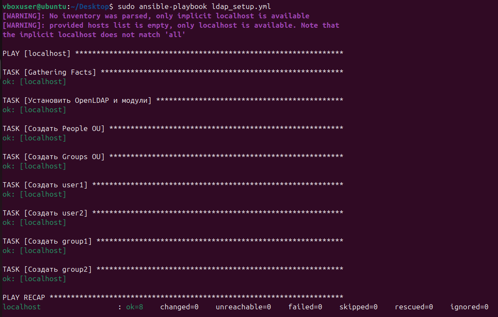

# OpenLDAP Setup с помощью Ansible
Проект настраивает OpenLDAP на Ubuntu 24.04 LTS через Ansible.  

Установить зависимости 
sudo apt update && sudo apt install -y ansible python3-ldap  
ansible-galaxy collection install community.general  

Запуск 
sudo ansible-playbook ldap_setup.yml  

Проверка  
ldapsearch -x -b "dc=example,dc=com" -D "cn=admin,dc=example,dc=com" -w adminpass  

Ожидаемый результат  
dn: dc=example,dc=com  
objectClass: top  
objectClass: dcObject  
objectClass: organization  
o: nodomain  
dc: example  

dn: ou=People,dc=example,dc=com  
objectClass: organizationalUnit  
ou: People  

dn: ou=Groups,dc=example,dc=com  
objectClass: organizationalUnit  
ou: Groups  

dn: uid=user1,ou=People,dc=example,dc=com  
objectClass: inetOrgPerson  
cn: User One  
sn: One  
uid: user1  
userPassword:: cGFzczE=  

dn: uid=user2,ou=People,dc=example,dc=com  
objectClass: inetOrgPerson  
cn: User Two  
sn: Two  
uid: user2  
userPassword:: cGFzczI=  

dn: cn=group1,ou=Groups,dc=example,dc=com  
objectClass: posixGroup  
cn: group1  
gidNumber: 5000  

dn: cn=group2,ou=Groups,dc=example,dc=com  
objectClass: posixGroup  
cn: group2  
gidNumber: 5001  

  
  
  
  
